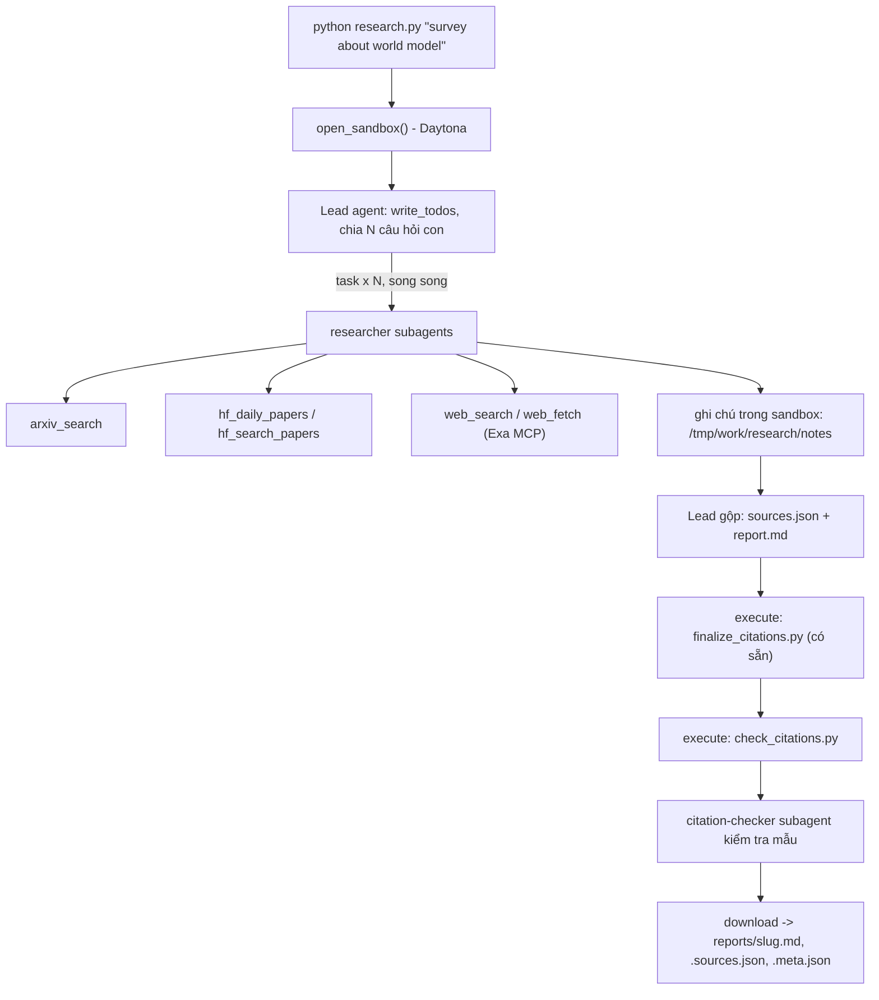

# Deep Research Agent (Deep Agents + Sandbox)

Lab dựng một **hệ thống deep research đa tác tử**: người dùng chỉ cần nhập một chủ đề (ví dụ `survey about world model`), hệ thống tự lập kế hoạch, giao việc cho nhiều subagent, tìm tài liệu trên arXiv, Hugging Face và web, rồi viết một **báo cáo có trích dẫn**.

Hình thức: **bài thực hành cá nhân**. Ngôn ngữ lập trình: Python 3.11 trở lên.

## 1. Mục tiêu học tập

Sau lab, bạn có thể:

1. Dựng agent bằng thư viện Deep Agents (LangChain): công cụ (tool), system prompt, subagent, backend.
2. Dùng **sandbox** (Daytona) làm không gian làm việc và nơi chạy mã cho agent; hiểu vì sao khóa API và công cụ mạng phải nằm ở phía host chứ không nằm trong sandbox.
3. Viết công cụ gọi API ngoài **chịu được giới hạn tốc độ** (retry, backoff, jitter, `Retry-After`).
4. Thiết kế quy trình đa tác tử: lead chia nhỏ câu hỏi, giao cho N researcher chạy song song, tổng hợp và kiểm tra trích dẫn.
5. Tạo báo cáo có thể kiểm chứng: mọi khẳng định có `[n]` trỏ tới một nguồn có thật.

## 2. Hệ thống làm gì



Nguồn dữ liệu:

| Nguồn | Dùng để |
|---|---|
| arXiv API `https://export.arxiv.org/api/query` | Tìm bài theo từ khóa, sắp theo ngày |
| Hugging Face Daily Papers `/api/daily_papers` | Bài đang "trending": upvotes, githubRepo, summary |
| Hugging Face papers search `/api/papers/search?q=` | Tìm bài theo chủ đề |
| Web qua Exa MCP (`web_search_exa`, `web_fetch_exa`) | Blog, survey, trang dự án, nội dung đầy đủ của một URL |

## 3. Cấu trúc thư mục

```
Lab/
├── README.md  GUIDE.md  RUBRIC.md  REPORT_TEMPLATE.md   tài liệu
├── topics.md                 5 chủ đề cần chạy
├── requirements.txt  .env.example  .gitignore
├── model.py                  CÓ SẴN - không sửa: tạo mô hình LLM từ biến môi trường
├── sandbox.py                CÓ SẴN - không sửa: sandbox Daytona (hoặc Docker), upload, download
├── self_check.py             CÓ SẴN - không sửa: tự kiểm tra trước khi nộp (python self_check.py)
├── finalize_citations.py     CÓ SẴN - không sửa: script chạy trong sandbox, tự sinh `## References` và đánh số lại trích dẫn
├── tools.py                  ĐÃ CÀI ĐẶT: retry + 5 công cụ nguồn dữ liệu
├── agents.py                 ĐÃ CÀI ĐẶT: prompt, subagent, lead agent, giới hạn vòng lặp
├── research.py               ĐÃ CÀI ĐẶT: script chính
├── check_citations.py        ĐÃ CÀI ĐẶT: kiểm tra trích dẫn, chạy TRONG sandbox
├── tests/                    test offline (mock mạng, đồng hồ, LLM): pytest
└── reports/                  báo cáo sinh ra (5 chủ đề x .md / .sources.json / .meta.json)
```

Bốn tệp "ĐÃ CÀI ĐẶT" là phần việc của sinh viên (các `TODO n` trong `GUIDE.md`); `model.py`, `sandbox.py`, `self_check.py`, `finalize_citations.py` giữ nguyên bản gốc.

## 4. Cài đặt

```bash
python3 -m venv .venv && source .venv/bin/activate      # Python 3.11+
pip install -r requirements.txt
pip install pytest                                       # chỉ để chạy test
cp .env.example .env                                     # rồi điền khóa CỦA BẠN
```

Nhà cung cấp LLM được hỗ trợ bởi các gói đã khai báo trong `requirements.txt`:

| Chế độ | `.env` | Gói |
|---|---|---|
| Endpoint tương thích OpenAI (OpenAI, OpenRouter, Groq, Ollama, vLLM...) | `LAB_BASE_URL`, `LAB_MODEL`, `LAB_API_KEY` hoặc `LAB_MODEL=openai:<model>` + `OPENAI_API_KEY` | `langchain-openai` |
| Google Gemini | `LAB_MODEL=google_genai:<model>` + `GOOGLE_API_KEY` | `langchain-google-genai` |
| Anthropic | `LAB_MODEL=anthropic:<model>` + `ANTHROPIC_API_KEY` | **chưa có sẵn**: `pip install langchain-anthropic` |

Lưu ý với gói miễn phí của Gemini: hạn mức theo phút/ngày rất thấp (một số model chỉ 5-20 yêu cầu), không đủ cho một lần chạy deep research. Bản nộp được chạy bằng `LAB_MODEL=google_genai:gemini-3.5-flash-lite` (15 yêu cầu/phút ở gói miễn phí tại thời điểm chạy). Tên và hạn mức model thay đổi: hãy tra tài liệu nhà cung cấp.

Bạn cần ba loại khóa (điền vào `.env`, **không bao giờ commit** `.env`):

| Khóa | Lấy ở đâu | Ghi chú |
|---|---|---|
| LLM (`LAB_MODEL` + khóa nhà cung cấp) | Nhà cung cấp bạn chọn (OpenAI, Anthropic, Google, OpenRouter, Ollama...) | Mô hình **phải hỗ trợ tool calling**. Chép tên mô hình từ tài liệu của nhà cung cấp. |
| `DAYTONA_API_KEY` | https://app.daytona.io | Kiểm tra gói miễn phí / credit hiện hành. Không có tài khoản hoặc hết credit: đặt `SANDBOX=docker` để chạy sandbox trong container Docker cục bộ (xem `.env.example`). |
| `EXA_API_KEY` (khuyến nghị) | https://dashboard.exa.ai/api-keys | Có thể chạy không khóa, nhưng bản miễn phí của MCP bị giới hạn tốc độ rất nhanh. |

## 5. Chạy

Kiểm tra theo thứ tự (rẻ -> đắt):

```bash
python -m pytest tests -q          # test offline: không gọi mạng, không gọi LLM, không tốn token
python tools.py                    # smoke test 5 công cụ nguồn dữ liệu với dịch vụ thật (cần mạng; EXA_API_KEY nên có)
python research.py "survey about world model"      # một chủ đề, đầu-cuối (LLM + sandbox + công cụ thật)
```

Chạy đủ 5 chủ đề: `python research.py "<chủ đề>"` cho từng dòng của [`topics.md`](topics.md). Mã thoát: `0` thành công, `1` lần chạy hỏng (không ghi tệp nào vào `reports/`), `2` thiếu chủ đề.

Mỗi chủ đề tạo ba tệp trong `reports/` (tên = `slugify(chủ đề)`):

| Tệp | Nội dung |
|---|---|
| `<slug>.md` | Báo cáo; `## References` do `finalize_citations.py` sinh trong sandbox |
| `<slug>.sources.json` | `[{n, id, url, title, date, source}]`; `source` = công cụ đã trả nguồn: `arxiv`, `hf-daily`, `hf-search`, `web` |
| `<slug>.meta.json` | `topic`, `model`, `elapsed_s`, `subagent_calls`, `tool_calls`, `tokens`, `n_sources`, `source_families` (`tokens` chỉ tính tin nhắn của lead, không gồm subagent) |

Kiểm tra trích dẫn và tự chấm:

```bash
python check_citations.py reports/<slug>.md reports/<slug>.sources.json   # phải in OK
python self_check.py                                                      # 5 báo cáo + meta + trích dẫn + không lộ khóa
```

## 6. Chủ đề và nộp bài

- Chạy đủ **5 chủ đề** trong [`topics.md`](topics.md), mỗi chủ đề một lần.
- Commit mã nguồn và toàn bộ `reports/`, đẩy lên một **public repo** GitHub và nộp link.
- Kiểm tra trước khi nộp: chạy **`python self_check.py`** (không tốn token): nó kiểm tra đủ 5 báo cáo, `meta.json`, trích dẫn bằng `check_citations.py` của bạn, và không có `.env`/khóa nào trong git.
- Cách chấm: xem [`RUBRIC.md`](RUBRIC.md).

## 7. Thời gian, chi phí và an toàn

- Dùng một mô hình **rẻ nhưng hỗ trợ tool calling**, và **đặt giới hạn** (số lần gọi mô hình/công cụ cho lead và subagent, `recursion_limit`): một prompt hỏng có thể khiến agent lặp rất lâu. Đây là hạng mục 2.5 của `RUBRIC.md`.
- Kết quả có tính ngẫu nhiên: cùng một mã có thể cho báo cáo hợp lệ ở lần này và trích dẫn lỗi ở lần sau. Hãy sửa **prompt và mã**, không sửa tay báo cáo.

- Mỗi lần chạy tốn token LLM và thời gian sandbox. `tokens` trong `meta.json` chỉ đếm tin nhắn của lead, chưa gồm subagent, nên chi phí thật cao hơn. `open_sandbox()` luôn dừng và xóa sandbox khi kết thúc, kể cả khi lỗi. Đừng bỏ qua nó.
- **Không đưa bí mật vào sandbox.** Sandbox không ngăn được prompt injection hay việc đẩy dữ liệu ra mạng; một trang web độc hại có thể khiến agent chạy lệnh bên trong sandbox. Vì vậy mọi công cụ gọi mạng và mọi khóa ở lại phía host.
- Nội dung lấy từ web là **dữ liệu không đáng tin**: agent không được làm theo chỉ dẫn nằm trong đó.
